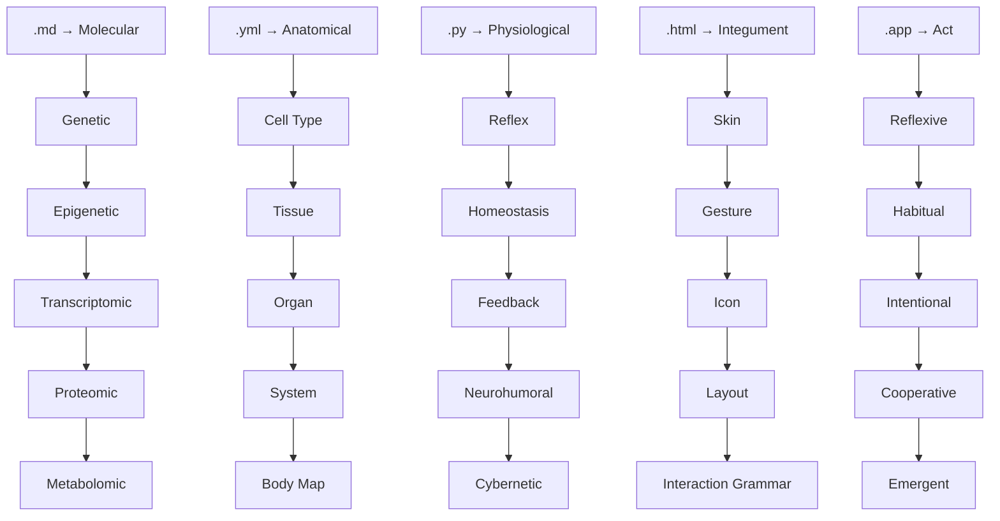

```mermaid
graph TD
  A[.md → Molecular] --> A1[Genetic]
  A1 --> A2[Epigenetic]
  A2 --> A3[Transcriptomic]
  A3 --> A4[Proteomic]
  A4 --> A5[Metabolomic]

  B[.yml → Anatomical] --> B1[Cell Type]
  B1 --> B2[Tissue]
  B2 --> B3[Organ]
  B3 --> B4[System]
  B4 --> B5[Body Map]

  C[.py → Physiological] --> C1[Reflex]
  C1 --> C2[Homeostasis]
  C2 --> C3[Feedback]
  C3 --> C4[Neurohumoral]

  C4 --> C5[Cybernetic]

  D[.html → Integument] --> D1[Skin]
  D1 --> D2[Gesture]
  D2 --> D3[Icon]
  D3 --> D4[Layout]
  D4 --> D5[Interaction Grammar]

  E[.app → Act] --> E1[Reflexive]
  E1 --> E2[Habitual]
  E2 --> E3[Intentional]
  E3 --> E4[Cooperative]
  E4 --> E5[Emergent]
```
